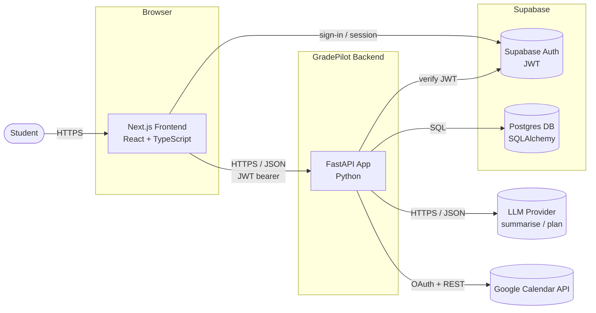
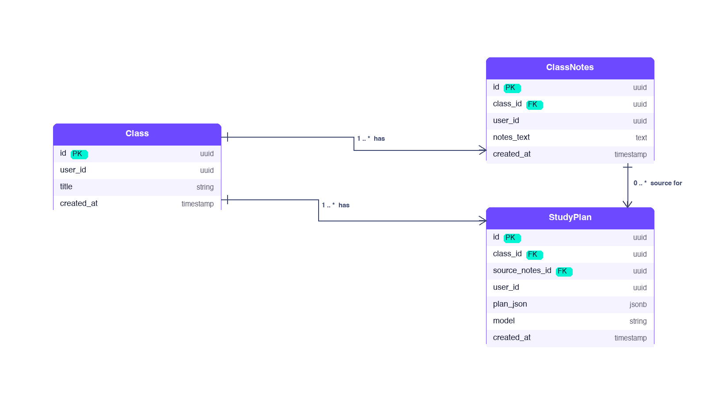
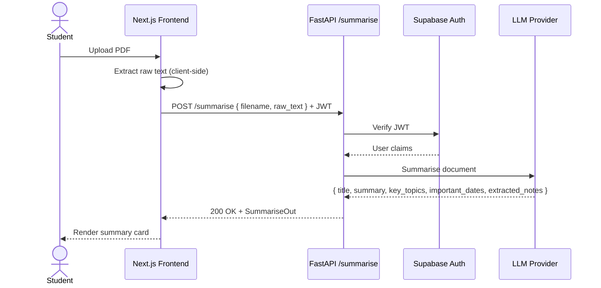

# GradePilot Architecture

This document captures the system architecture for GradePilot, an autonomous study-planning agent for students. It contains a high-level component diagram, an entity diagram for the notes-to-study-plan capability, and a call sequence diagram for the "summarise notes" feature.

All diagrams are written in [Mermaid](https://mermaid.js.org/) so they render natively on GitHub.

---

## Step 1: High-Level Component Diagram

**Description.** The student opens GradePilot in their browser, which loads the Next.js frontend. When they sign in, the frontend talks to Supabase Auth, which checks who they are and gives back a login pass. After that, anytime the student does something like uploading notes or asking for a study plan, the frontend sends the request to the FastAPI backend with that pass so the backend knows it's really them. The backend handles the heavy stuff like saving things to the Postgres database, asking the AI to summarise notes or build study plans, and syncing with Google Calendar.

---

## Step 2: Entity Diagram (Notes to Study Plan)

This diagram shows the main feature of turning uploaded class notes into an AI-built study plan. It covers the three tables that work together to make that happen.

**Description.** A Class is one of the student's courses, like Math 101. Inside a class, the student can upload notes, and each upload becomes a ClassNotes row that stores the text. From those notes, the AI builds a StudyPlan, which links back to the class it belongs to and the notes it was built from. Every row also tracks who owns it so students only see their own stuff, and if a class is deleted all the notes and plans inside get cleaned up automatically.

---

## Step 3: Call Sequence Diagram (Summarise Notes)

This sequence shows the `/summarise` feature where a student uploads a PDF and gets back a clean summary. The frontend pulls out the text and the backend gets the AI to do the hard part.

**Description.** When the student uploads a PDF, the frontend pulls the text out of it right in the browser, so the whole file never has to leave the computer. It then sends just the text to the backend's `/summarise` endpoint with the login pass attached. The backend checks the pass with Supabase Auth first, and if it's fake or expired the request is rejected before anything costly happens. If it's good, the AI reads the text and sends back a clean breakdown with a title, summary, key topics, important dates, and a tidied up version of the notes, which the frontend shows to the student.
