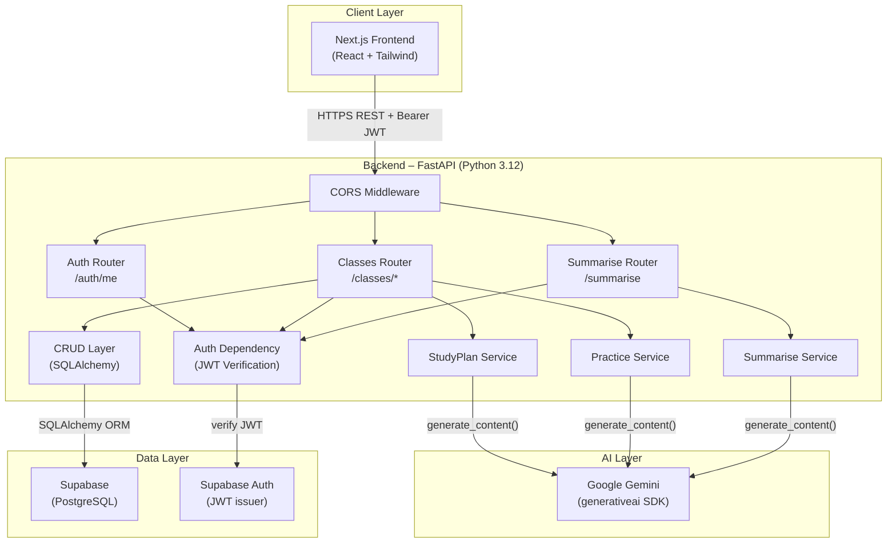
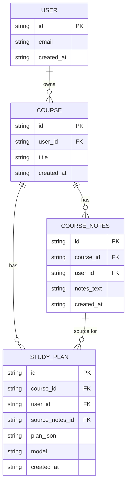
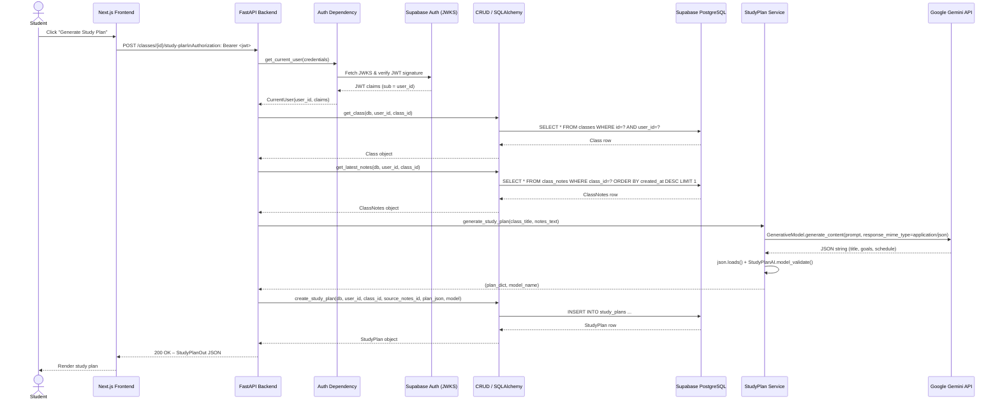

# GradePilot Architecture

## Step 1 – High-Level Component Diagram

The GradePilot system is composed of four layers. The **Next.js frontend** (React + Tailwind CSS) runs in the browser and communicates with the backend exclusively over HTTPS REST calls, attaching a Supabase-issued JWT as a Bearer token. The **FastAPI backend** is the central hub: a CORS middleware layer gates all incoming requests, three routers (`/auth`, `/classes`, `/summarise`) handle distinct concerns, and a shared auth dependency validates every JWT against the Supabase Auth JWKS endpoint before any handler executes. Business logic lives in three service modules — `StudyPlanService`, `PracticeService`, and `SummariseService` — each of which calls the **Google Gemini API** (via the `google-generativeai` SDK) to generate structured JSON responses. Persistent data (classes, notes, study plans) is written and read through a SQLAlchemy CRUD layer that connects to **Supabase PostgreSQL**.

---

## Step 2 – Entity Diagram

These four entities model the core academic-planning capability of GradePilot. A **USER** (managed by Supabase Auth) can own many **CLASS** records, each representing a course the student is enrolled in. Each class can accumulate many **CLASS_NOTES** entries — raw text the student pastes or uploads from their course materials. A **STUDY_PLAN** is generated from a specific set of notes: it holds a foreign key to both the parent `CLASS` and the `CLASS_NOTES` record that was used as source material (`source_notes_id`), allowing the system to trace which notes produced which plan. The generated schedule is stored as a `JSONB` blob (`plan_json`) alongside the name of the Gemini model that produced it, enabling future model comparisons. All tables carry a `user_id` column so that row-level security policies in Supabase can enforce per-user data isolation at the database layer.

---

## Step 3 – Call Sequence Diagram (Study Plan Generation)

This sequence traces the full lifecycle of a study-plan generation request. The student triggers the flow from the Next.js dashboard; the frontend attaches the Supabase JWT and calls `POST /classes/{id}/study-plan`. The FastAPI auth dependency immediately validates the token against Supabase's JWKS endpoint and extracts the `user_id` from the `sub` claim. The classes router then performs two guarded database reads — first confirming the class belongs to the authenticated user, then fetching the most recent notes for that class. With the notes text in hand, the `StudyPlanService` constructs a structured prompt and calls the Google Gemini API, requesting a JSON response. The raw JSON string is parsed and validated against the `StudyPlanAI` Pydantic schema before being persisted to Supabase via SQLAlchemy. Finally, the serialised `StudyPlanOut` is returned to the frontend for rendering.
