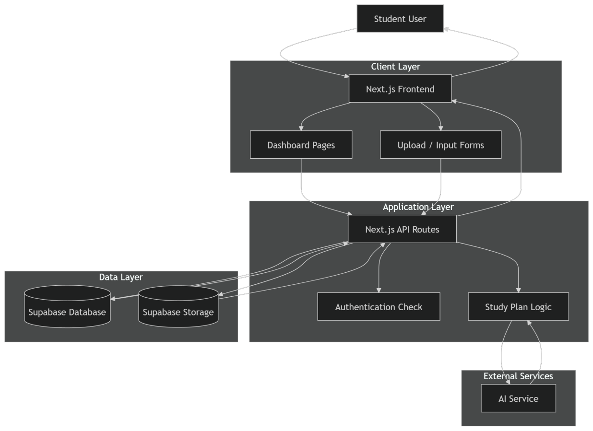
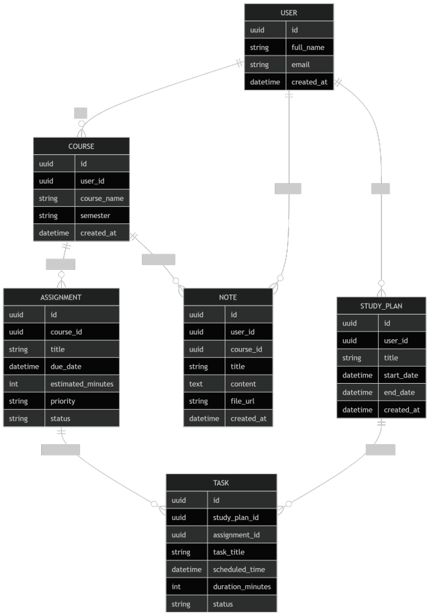

# GradePilot Architecture

## Overview
GradePilot is an autonomous academic planning agent. The system is designed to allow students to upload course materials, extract and prioritize tasks, generate study plans, and synchronize with Google Calendar.

## Architecture Diagram

## Architecture Components and Interaction

The GradePilot system architecture consists of four primary layers. The **Client Layer** provides a Next.js Frontend for the student user, containing Dashboard Pages and Upload/Input Forms. This frontend communicates directly with the **Application Layer**, which utilizes Next.js API Routes to handle backend operations such as Authentication Checks and Study Plan Logic. The application layer securely accesses the **Data Layer**, consisting of Supabase Database and Supabase Storage, to retrieve and persist user data and documents. Finally, the **External Services** layer integrates an AI Service that is utilized by the Study Plan Logic to analyze inputs and generate tailored academic content for the users.

## Entity Relationship Diagram

## Entities and Relationships

The core data model for GradePilot consists of six primary entities centered around academic planning. A **USER** serves as the root entity, maintaining a one-to-many relationship with their enrolled **COURSE**s, uploaded **NOTE**s, and generated **STUDY_PLAN**s. Each **COURSE** contains multiple **ASSIGNMENT**s and can be linked to multiple **NOTE**s. To model the study planning capability, the **ASSIGNMENT**s are broken down into actionable items called **TASK**s. These **TASK**s are scheduled within a specific **STUDY_PLAN**, forming a many-to-one relationship with the plan, while also maintaining a reference back to the original assignment.

## Infrastructure and Deployment
- **Containerization**: Multi-stage Docker builds.
- **Compute**: Deployed to Google Cloud Platform (GCP) Cloud Run.
- **CI/CD**: Managed via GitHub Actions workflows for continuous integration and continuous deployment to Cloud Run.
