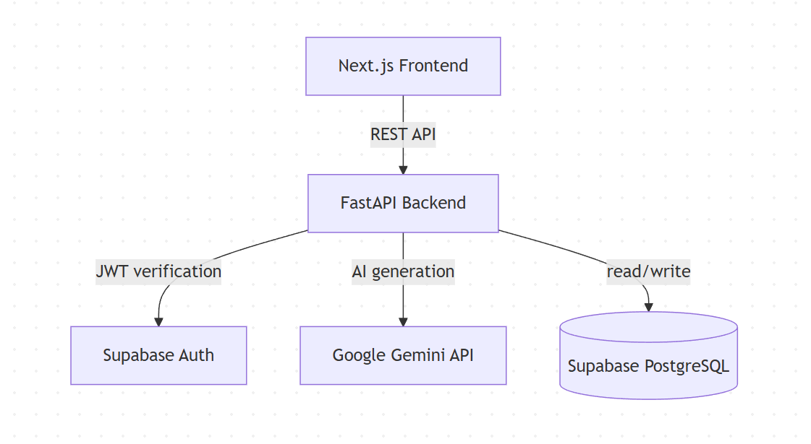
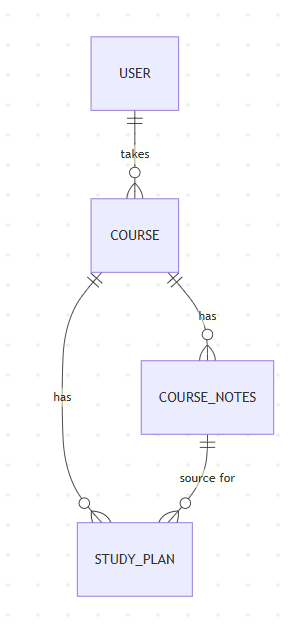
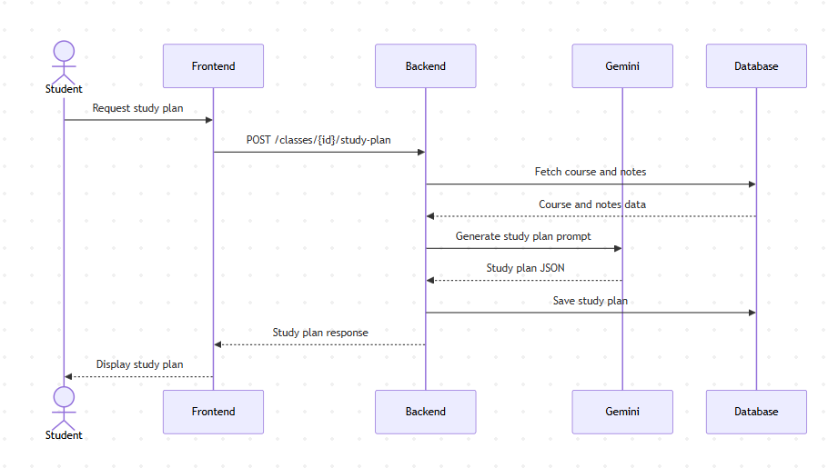

# GradePilot Architecture

## Step 1 – High-Level Component Diagram

The frontend sends REST requests to the FastAPI backend, which validates the user's JWT with Supabase Auth. Depending on the request, the backend either reads or writes data to Supabase PostgreSQL, or calls the Google Gemini API to generate study plans, practice questions, or document summaries.

---

## Step 2 – Entity Diagram

A user can take many courses. Each course can have many notes and many study plans. A study plan is linked to the notes it was generated from, so the system can trace which notes produced which plan.

---

## Step 3 – Call Sequence Diagram

The student requests a study plan from the dashboard. The backend fetches the relevant course and notes from the database, sends a prompt to Google Gemini, and saves the returned study plan back to the database before returning it to the frontend for display.
